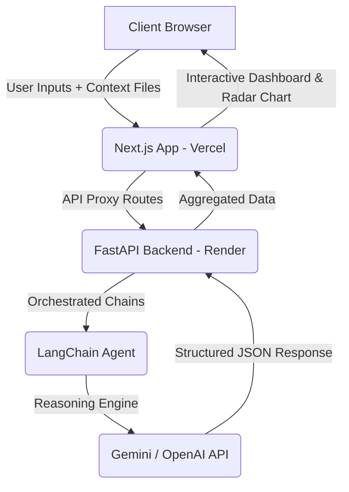

# PathSmith


PathSmith is an AI-powered life decision simulator designed to help users clarify complex dilemmas, weigh competing choices, and evaluate branching futures. By combining structured decision-making framework inputs with advanced LLM reasoning, PathSmith maps out pathways, identifies cognitive blind spots, and recommends the optimal course of action based on user-defined constraints.

---

##  Key Features

*   **Short-Term vs. Long-Term Decision Toggles:**
    *   **Short-Term Mode:** Focuses on immediate tradeoffs, pros/cons, and core statistics for each alternative.
    *   **Long-Term Mode:** Projects future scenarios, long-term outcomes, and branching possibilities over time.
*   **Unbiased AI Recommendation:**
    *   Analyze options based on constraint weights and objective reasoning. The system compares every path dynamically and provides a recommended choice, explicitly explaining *why* it fits best.
*   **Dynamic Alignment Matrix (Radar Chart):**
    *   Compare paths visually across five key axes: **Reward**, **Risk**, **Growth**, **Effort**, and **Values Alignment** using a custom themed radar chart.
*   **Path Stress Testing (Regret Minimization):**
    *   Select any path to run a "Stress Test" simulate extreme downside scenarios, and evaluate regret potential before committing.
*   **Side-by-Side Comparison:**
    *   Select any two generated paths to compare key stats, tradeoffs, and metrics side-by-side in a split-screen dashboard.
*   **Drag-and-Drop Document Context (RAG):**
    *   Upload external resumes, budget spreadsheets, or diary notes (`.pdf` or `.txt`) to inject personalized context into the simulator.
*   **Local Simulation History:**
    *   Save simulations locally. Browse, reload, or delete past decisions using the sliding history panel.

---

## Tech Stack

### Frontend
*   **Framework:** Next.js 14 (App Router)
*   **Styling:** Tailwind CSS & Custom CSS (Glassmorphism & animations)
*   **Animations:** Framer Motion
*   **Charts:** Recharts (Custom SVG Radar Charts)
*   **State Management:** Zustand (with localStorage persistence)

### Backend
*   **Framework:** FastAPI (Python)
*   **Orchestration:** LangChain & Pydantic
*   **AI Integration:** OpenAI & Gemini (configurable via frontend UI)

---

## Architecture Flow



---

## How to Access and Run PathSmith

You can interact with PathSmith in two ways:

### Option 1: Direct Website Access (Live Site)
You can access and test the deployed live application directly online:
👉 **[path-smith-ruddy.vercel.app](path-smith-ruddy.vercel.app)**

> [!NOTE]
> **Free-Tier Cold Starts:**
> The backend server is hosted on a free tier of Render, which goes to sleep after 15 minutes of inactivity. When you run your first decision path simulation on the live site, it may take **30–50 seconds** to wake the server up. Subsequent simulations will load instantly.

---

### Option 2: Local Setup & Development

If you want to run the project locally on your machine, follow these instructions:

#### 1. Backend Setup (FastAPI)
*Prerequisites: Python 3.9+ installed.*

1. Navigate to the backend directory:
   ```bash
   cd backend
   ```
2. Create and activate a virtual environment:
   ```bash
   python -m venv venv
   # On Windows (PowerShell):
   .\venv\Scripts\Activate.ps1
   # On macOS/Linux:
   source venv/bin/activate
   ```
3. Install the required dependencies:
   ```bash
   pip install -r requirements.txt
   ```
4. Run the FastAPI server:
   ```bash
   uvicorn main:app --port 8000 --reload
   ```

The backend server will run locally at `http://127.0.0.1:8000`.

#### 2. Frontend Setup (Next.js)
*Prerequisites: Node.js 18+ installed.*

1. Navigate to the frontend directory:
   ```bash
   cd frontend
   ```
2. Install dependencies:
   ```bash
   npm install
   ```
3. Create a local environment variables file:
   ```bash
   cp .env.local.example .env.local
   ```
   *In `.env.local`, set `BACKEND_URL` to `http://localhost:8000` for local testing.*
4. Start the Next.js development server:
   ```bash
   npm run dev
   ```

Open `http://localhost:3000` (or the port specified in terminal) in your browser.

